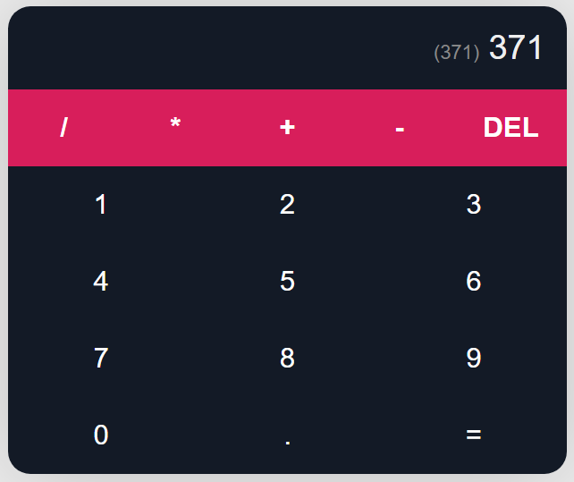

# Calculadora Windows JS (React) (operações + - / *)

Desenvolver uma calculadora utilizando javascript para matéria de Desenvolvimento Web III
* Entradas de dados somente com buttons
* Não deve existir input na interface da calculadora.
 

  

  
This project was bootstrapped with [Create React App](https://github.com/facebook/create-react-app).
